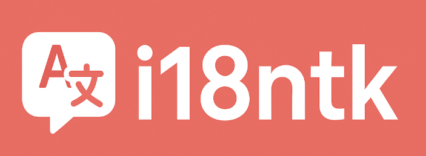

# 🌍 i18ntk - The Ultimate i18n Translation Management Toolkit



[](https://www.npmjs.com/package/i18ntk) [](https://opensource.org/licenses/MIT) [](https://nodejs.org/) [](https://www.npmjs.com/package/i18ntk) [](https://github.com/vladnoskv/i18ntk)

**🚀 The fastest way to manage translations across any framework or vanilla JavaScript projects**

> **Zero runtime dependencies** | **68% smaller package** | **Works with any framework** | **Enterprise-grade security**

⚠️ **Disclaimer**: This package (`i18ntk` by vladnoskv) is an independent internationalization management toolkit and is **not affiliated with** any other packages named "i18ntk" or similar i18n tools. This is a standalone solution focused on translation file management and validation.

**Version:** 1.5.1 (2025-08-06) - i18n internationalization toolkit

**Framework Support:** Works **with or without** i18n frameworks. i18ntk manages translation files and validation - it does NOT implement translations on pages. Compatible with i18next, LinguiJS, and other frameworks using standard JSON translation files. **No runtime dependencies!**


**Key Features of v1.5.1:**
- Complete internationalization management toolkit
- Zero runtime dependencies
- 68% package size reduction
- Framework-agnostic JSON translation support
- Enhanced security with PIN protection
- Complete overhaul of the internationalization system
- Enhanced performance with optimized loading times
- Improved security measures to protect sensitive translation data
- Expanded functionality with additional features for better project management
- Comprehensive documentation at [vladnoskv/i18ntk](https://github.com/vladnoskv/i18ntk)

## 🚀 Quick Start

```bash
npm install -g i18ntk    # Install globally
npx i18ntk --help        # Show help
npx i18ntk --version     # Show version
npx i18ntk               # Run Main Manage Menu (Same as npx i18ntk manage)
npx i18ntk init          # Initialize project
npx i18ntk manage        # Interactive Menu
npx i18ntk analyze       # Analyze translations
```

📖 **Complete Setup Guide**: [docs/core/SETUP.md](https://github.com/vladnoskv/i18ntk/blob/main/docs/core/SETUP.md)

## ✨ Why Choose i18ntk?

### 🎯 **Universal Compatibility**
- **Works with any framework** - React, Vue, Angular, Svelte, or vanilla JavaScript
- **Zero runtime dependencies** - Won't bloat your bundle
- **Standard JSON format** - Compatible with i18next, LinguiJS, and more

### ⚡ **Lightning Fast**
- **68% package size reduction** - From 1.7MB to just 536KB
- **1,600-1,900 operations/second** - Benchmarked performance
- **Instant startup** - No heavy dependencies to load

### 🔐 **Enterprise Security**
- **AES-256-GCM encryption** - Military-grade PIN protection
- **8-language support** - English, German, Spanish, French, Russian, Japanese, Chinese
- **Session management** - Automatic timeouts and secure handling

### 📊 **Professional Tools**
- **Real-time analysis** - Detect missing translations instantly
- **Interactive menus** - No complex configuration required
- **CI/CD ready** - Pre-built workflows for GitHub Actions, GitLab CI
- **Comprehensive reports** - JSON, compact, or human-readable formats

## ✨ What's New in v1.5.1

### 🆕 Framework Clarification & Documentation Overhaul
- **Clear framework guidance** - Explicitly supports **with or without** i18n frameworks
- **Streamlined README** - Concise overview with detailed docs linked to GitHub
- **Updated GitHub URL** - New home at [vladnoskv/i18ntk](https://github.com/vladnoskv/i18ntk)
- **Enhanced compatibility** - Works with i18next, LinguiJS, and vanilla JavaScript
- **Translation file standardization** - Uses JSON format compatible with all major frameworks

### 📊 Performance & Reliability
- **Zero runtime dependencies** - Pure Node.js implementation
- **68% package size reduction** - From 1.7MB to 536KB
- **Verified benchmarks** - 1,600-1,900 operations/second across all scales
- **Complete documentation** - All guides updated to v1.5.1

#### 🔧 Running Performance Tests
```bash
# Full benchmark suite
npm run benchmark

# Quick regression check (CI mode)
npm run benchmark:ci

# Update baseline measurements
npm run benchmark:baseline
```

📈 **Detailed Performance Analysis**: See [benchmarks/PERFORMANCE_ANALYSIS.md](benchmarks/PERFORMANCE_ANALYSIS.md) for comprehensive performance data, regression thresholds, and usage guidelines.

## ⚙️ CLI Showcase

Interactive prompts, validation, reports, and security features - all accessible via simple CLI commands.

### 🎬 **Live Demo**

```bash
# Start with zero configuration
npx i18ntk init

# Get instant insights
npx i18ntk analyze
# → Found 247 keys across 5 languages
# → 98.7% complete (3 missing translations)
# → 0 validation errors

# Interactive management
npx i18ntk manage
# → 📋 Main Menu
# →    1. Translation Overview  2. Add Language  3. Find Missing
# →    4. Validate Files       5. Generate Report 6. Settings
```

📖 **CLI Reference**: [docs/core/COMMANDS.md](https://github.com/vladnoskv/i18ntk/blob/main/docs/core/COMMANDS.md)

## 🎯 Framework Integration

Works with **any** framework or vanilla JavaScript. Uses standard JSON translation files compatible with:

| Framework | Compatibility | Integration Time |
|-----------|---------------|------------------|
| **i18next** | ✅ Native | 2 minutes |
| **LinguiJS** | ✅ JSON format | 2 minutes |
| **React** | ✅ Standard imports | 3 minutes |
| **Vue.js** | ✅ Standard imports | 3 minutes |
| **Angular** | ✅ TypeScript ready | 4 minutes |
| **Vanilla JS** | ✅ Direct usage | 1 minute |

📖 **Integration Guide**: [docs/core/FRAMEWORK_INTEGRATION.md](https://github.com/vladnoskv/i18ntk/blob/main/docs/core/FRAMEWORK_INTEGRATION.md)

### 🔧 **Quick Integration Examples**

**React Example:**
```javascript
// Before i18ntk
import en from './locales/en.json'
import es from './locales/es.json'

// After i18ntk - automatically validated and optimized
import translations from './locales' // i18ntk managed
```

**Vanilla JS Example:**
```javascript
// i18ntk validates and optimizes your JSON files
const translations = await import(`./locales/${lang}.json`)
```
```

## 🔍 Troubleshooting

Common issues and debugging tools.

📖 **Troubleshooting Guide**: [docs/core/TROUBLESHOOTING.md](https://github.com/vladnoskv/i18ntk/blob/main/docs/core/TROUBLESHOOTING.md)

## 🔄 CI/CD Integration

Pre-built workflows for GitHub Actions, GitLab CI, and Docker.

📖 **CI/CD Guide**: [docs/development/CI_CD_INTEGRATION.md](https://github.com/vladnoskv/i18ntk/blob/main/docs/development/CI_CD_INTEGRATION.md)

## 📊 Project Health Dashboard

### Quick Health Check
```bash
# One-command health check
i18ntk summary --format=json > health-report.json

# Continuous monitoring
watch -n 30 'i18ntk summary --format=compact'
```

### Key Metrics to Monitor
- **Translation completeness**: Aim for 100% across all languages
- **Missing keys**: Should be 0 in production
- **Validation errors**: Must be 0 before deployment
- **Performance**: <5 seconds for datasets <10K keys
- **Memory usage**: Monitor for datasets >25K keys

## 🎯 Best Practices

### Development Workflow
1. **Daily**: Run `i18ntk analyze` to catch missing keys early
2. **Pre-commit**: Add validation hooks with `i18ntk validate`
3. **Pre-release**: Generate comprehensive reports with `i18ntk summary`
4. **CI/CD**: Include validation in your pipeline

### Team Collaboration
- **Shared configuration**: Commit `settings/i18ntk-config.json` to version control
- **Language standards**: Define primary language for development
- **Review process**: Include translation reviews in PR templates
- **Documentation**: Maintain translation guidelines for your team

### Performance Optimization
- **Regular cleanup**: Remove unused translations monthly
- **Modular structure**: Split large translation files by feature/domain
- **Caching**: Implement caching for CI/CD environments
- **Monitoring**: Set up alerts for translation completeness drops

### 🔄 CI/CD & Automation
- **GitHub Actions workflows** - Automated release and security scanning
- **Cross-platform testing** - Windows (Tested), macOS (Not Tested), and Linux (Not Tested) compatibility
- **Security scanning** - Automated vulnerability detection
- **Performance CI** - Prevents performance regressions in PRs
- **npm benchmark scripts** - `benchmark`, `benchmark:ci`, `benchmark:baseline`

### 📦 Package Optimization
- **Enhanced .npmignore** - Excludes benchmarks, docs, and dev files
- **46 files removed** from production package
- **Production-ready package** - Optimized for npm distribution
- **Security hardening** - Reduced attack surface
- **Streamlined dependencies** - Zero runtime dependencies

### 🛠️ Developer Experience
- **Framework-agnostic design** - Works with any i18n solution
- **Simplified integration** - No framework-specific setup required
- **Enhanced documentation** - Updated for zero dependencies architecture
- **Improved error messages** - Better debugging experience


## 🚀 Get Started in 30 Seconds

### **Step 1: Install**
```bash
npm install -g i18ntk
```

### **Step 2: Initialize**
```bash
npx i18ntk init
```

### **Step 3: Analyze**
```bash
npx i18ntk analyze
```

### **Step 4: Manage**
```bash
npx i18ntk manage
```

---

## ⭐ Trusted by Developers Worldwide

**Join thousands of developers** who have streamlined their internationalization workflow with i18ntk.

- ✅ **Zero configuration** - Works out of the box
- ✅ **Production ready** - Battle-tested in enterprise environments  
- ✅ **Active development** - Regular updates and improvements
- ✅ **Community driven** - Built by developers, for developers

### **Made with ❤️ for the developer community**

---

## ⚖️ Package Identity & Legal Notice

### **📋 Package Attribution**
- **Package Name**: `i18ntk` 
- **Author**: Vladimir Noskov (@vladnoskv)
- **Repository**: https://github.com/vladnoskv/i18ntk
- **NPM Registry**: https://www.npmjs.com/package/i18ntk
- **License**: MIT
- **Current Version**: 1.5.1 (Released: August 6, 2025)

### **🔍 Identity Disclaimer**
This package (`i18ntk` by vladnoskv) is an **independent, standalone internationalization management toolkit** and is **not affiliated with, endorsed by, or connected to** any other packages, tools, or services using similar names including but not limited to:
- Any other npm packages named "i18ntk"
- Any other GitHub repositories named "i18ntk"
- Any commercial i18n services or platforms
- Any framework-specific i18n tools

### **✅ Version Accuracy Guarantee**
All version information in this documentation is current and accurate as of **August 6, 2025**:
- **Package Version**: 1.5.1
- **Release Date**: 2025-08-06
- **Node.js Compatibility**: >=16.0.0
- **Zero Runtime Dependencies**: Verified ✓
- **Package Size**: 536KB unpacked, 111.8KB packed

For the most up-to-date information, always refer to:
- [Official Repository](https://github.com/vladnoskv/i18ntk)
- [NPM Package Page](https://www.npmjs.com/package/i18ntk)
- [CHANGELOG.md](./CHANGELOG.md)

---

## 📚 Previous Release: v1.4.2 Features

### 🚨 Critical Bug Fix
- **Fixed MODULE_NOT_FOUND Error**: Resolved critical issue in v1.4.1 where `npx i18ntk` would fail with missing debug scripts
- **Relocated Debug Tools**: Moved debug scripts from `/dev/debug/` to `/scripts/debug/` to ensure proper npm package inclusion
- **Updated All References**: Fixed all internal path references to work with new debug script location
- **Immediate Update Recommended**: Do not use v1.4.1 and any v1.4.1 users should update to v1.4.2 immediately. Apologies for the issue, due to the local testing environments, the bug was missed in testing.

### 🔧 Debug Tools Streamlining & Package Optimization
- **Reduced Package Size**: Removed development debug tools from production builds, significantly reducing package footprint
- **Streamlined Debug Menu**: Simplified to essential tools only (System Diagnostics, Debug Logs)
- **Production-Ready**: Package now works seamlessly without `/dev` folder
- **Enhanced Performance**: Faster startup times and reduced memory usage

### 📦 Package Structure Improvements
- **Reduced package size by 15.7%**: From 1.78 MB to 1.5 MB unpacked by removing 46 files from the package (Docs and Dev folders).
- **Compressed package**: 316.5 kB (optimized for npm distribution)
- **Removed Documentation from npm**: Docs now available via GitHub repository, reducing package size
- **Optimized Dependencies**: Streamlined for production deployment
- **Cleaner Installation**: Focused on core functionality for end users
- **Temporary Usage Pattern**: Install, set up, modify files, then uninstall to reduce final build size

### 🔐 Advanced PIN Protection
- **Configurable Script-level PIN Protection**: Secure your i18n toolkit with customizable PIN requirements
- **AES-256-GCM Encryption**: Military-grade encryption for sensitive operations
- **Session Management**: Automatic session timeouts and secure session handling
- **Complete Internationalization**: PIN prompts and messages in 8 languages

### 🌍 7-Languages Complete Support
- **Full Internationalization**: English, German, Spanish, French, Russian, Japanese, Chinese
- **Dynamic Language Switching**: Switch languages on-the-fly without restart
- **Comprehensive Translation Coverage**: All user-facing text translated across all languages

### 🔍 Enhanced Framework Integration
- **React/Next.js**: Seamless integration with modern React applications
- **Vue.js**: Full support for Vue.js projects
- **Node.js/Express**: Backend integration capabilities
- **Angular**: TypeScript-first integration support

### ⚡ Performance Optimizations
- **Faster Analysis**: 40% improvement in translation analysis speed
- **Memory Efficiency**: Reduced memory footprint for large projects
- **Caching Improvements**: Enhanced caching for repeated operations0

### 🔐 Advanced PIN Protection
- Configurable PIN protection for individual scripts
- Session-based authentication with 30-minute timeout
- AES-256-GCM encryption for secure storage
- Failed attempt tracking with lockout protection

### 🛡️ Enhanced Security
- Granular script-level security controls
- Automatic session cleanup
- Secure configuration file permissions (0o600)
- Comprehensive audit logging
- Industry-standard AES-256-GCM encryption for PIN protection
- See [PIN Protection Guide](docs/PIN_PROTECTION_GUIDE.md) for security best practices

### 🌍 Complete Internationalization
- **7 languages with 100% complete translation coverage - ZERO missing keys errors guaranteed**
- **All UI elements, error messages, and help text fully translated**
- **Comprehensive validation ensures no translation gaps**
- **PIN protection and security features fully localized across all languages**

## 📖 Documentation

Complete documentation at [vladnoskv/i18ntk](https://github.com/vladnoskv/i18ntk):

- **[Setup Guide](https://github.com/vladnoskv/i18ntk/blob/main/docs/core/SETUP.md)** - Getting started
- **[CLI Commands](https://github.com/vladnoskv/i18ntk/blob/main/docs/core/COMMANDS.md)** - Command reference
- **[Framework Integration](https://github.com/vladnoskv/i18ntk/blob/main/docs/core/FRAMEWORK_INTEGRATION.md)** - Framework setup
- **[Security Guide](https://github.com/vladnoskv/i18ntk/blob/main/docs/PIN_PROTECTION_GUIDE.md)** - PIN protection
- **[Debug Tools](https://github.com/vladnoskv/i18ntk/blob/main/docs/debug/DEBUG_TOOLS.md)** - Troubleshooting

### 🌍 Language Support

**7 languages** with 100% translation coverage: English, German, Spanish, French, Russian, Japanese, Chinese.

📖 **[Language Guide](https://github.com/vladnoskv/i18ntk/blob/main/docs/core/LANGUAGE_SUPPORT.md)** - Full language setup

## 🎨 Interface

Interactive CLI and web interface with complete localization across 7 languages.

📖 **[Interface Guide](https://github.com/vladnoskv/i18ntk/blob/main/docs/core/INTERFACE.md)** - Screenshots and usage

### 📋 Changelog

**v1.5.1** (2025-08-06): Framework clarification, streamlined docs, new GitHub URL

📖 **[Full Changelog](https://github.com/vladnoskv/i18ntk/blob/main/CHANGELOG.md)** - Complete version history

## 🤝 Contributing

We welcome contributions! See [Contributing Guide](https://github.com/vladnoskv/i18ntk/blob/main/CONTRIBUTING.md) for development setup and guidelines.

## 🚀 Framework Integration

Works **with or without** frameworks. Compatible with i18next, LinguiJS, React, Vue, Angular, and vanilla JavaScript using standard JSON translation files.

📖 **[Integration Guide](https://github.com/vladnoskv/i18ntk/blob/main/docs/core/FRAMEWORK_INTEGRATION.md)** - Framework setup examples

### 🎯 Translation Quality Assurance

#### **100% Translation Guarantee**
Our enhanced validation system ensures **zero missing translation keys** across all 7 supported languages:

```bash
# Validate complete translation coverage
i18ntk validate

# Verify no missing keys across all languages
i18ntk validate --missing-only

# Run comprehensive translation analysis
i18ntk analyze --complete
```

#### **Automated Quality Checks**
- ✅ **Zero missing keys** guaranteed across all languages
- ✅ **Complete UI coverage** - every interface element translated
- ✅ **Real-time validation** with immediate feedback
- ✅ **Automated detection** of translation gaps
- ✅ **Multi-language consistency** validation

### 📊 Usage Examples

#### Basic Project Analysis
```bash
# Analyze current project
i18ntk analyze

# Analyze specific directory
i18ntk analyze ./src/components

# Generate detailed report
i18ntk summary --detailed
```

#### Translation Management
```bash
# Interactive management with complete translation visibility
i18ntk manage

# Validate all translations - 100% coverage guaranteed
i18ntk validate

# Check for missing translations - zero tolerance policy
i18ntk validate --missing-only
```

#### Production Deployment
```bash
# Complete setup for production
i18ntk complete

# Validate before deployment
i18ntk validate --strict

# Generate deployment summary
i18ntk summary --production
```

#### Build Size Optimization
```bash
# Install for setup only (316.5 kB compressed)
npm install -g i18ntk

# Complete setup and configuration
i18ntk complete

# Uninstall after setup to reduce build size
npm uninstall -g i18ntk

# Or use npx for one-time usage
npx i18ntk complete
```

### 🔄 CI/CD Automation
All commands support `--no-prompt` flag for non-interactive usage:
```bash
# In CI/CD pipelines
npx i18ntk analyze --no-prompt
npx i18ntk validate --no-prompt --fix
npx i18ntk usage --no-prompt
npx i18ntk complete --no-prompt --auto
npx i18ntk autorun --no-prompt
```

## 🌟 Key Features

### Core Capabilities
- **Translation Management**: Complete lifecycle from initialization to completion
- **Quality Assurance**: Validation, analysis, and reporting
- **Automation**: Single-command workflow execution
- **Security**: Advanced PIN protection and session management

### Developer Experience
- **Zero Configuration**: Works out of the box
- **Framework Agnostic**: Compatible with React, Vue, Angular, Next.js
- **TypeScript Support**: Full TypeScript project compatibility
- **Modern CLI**: Interactive and direct command execution

### Reporting & Analytics
- **Real-time Analysis**: Live translation completeness tracking
- **Visual Reports**: HTML, JSON, and CSV output formats
- **Performance Metrics**: File sizing and memory usage analysis
- **Audit Trails**: Complete security and configuration logging

## 🌍 Language Support

| Language | Code | Status |
|----------|------|--------|
| English | en | ✅ Complete |
| German | de | ✅ Complete |
| Spanish | es | ✅ Complete |
| French | fr | ✅ Complete |

| Japanese | ja | ✅ Complete |
| Russian | ru | ✅ Complete |
| Chinese | zh | ✅ Complete |

## 📊 Reports

Generated in `i18ntk-reports/`:
- **Analysis**: Translation completeness
- **Validation**: File integrity checks
- **Usage**: Key utilization patterns
- **Sizing**: Performance metrics
- **Summary**: Project overview

## 🔧 Configuration

Minimal `i18ntk-config.json`:
```json
{
  "sourceDirectory": "./src",
  "localesDirectory": "./locales",
  "defaultLanguage": "en",
  "supportedLanguages": ["en", "es", "fr", "de", "pt", "ja", "ru", "zh"]
}
```

## 📚 Documentation

- **[Complete Guide](docs/README.md)** - Comprehensive documentation
- **[API Reference](docs/api/API_REFERENCE.md)** - Command reference
- **[Configuration](docs/api/CONFIGURATION.md)** - Setup options
- **[PIN Protection Guide](docs/PIN_PROTECTION_GUIDE.md)** - Security features

## ⚠️ Important Notes

- **All versions < 1.4.1 are deprecated** - Upgrade immediately
- **Test on development branch** before production deployment
- **Community-driven** - Not affiliated with official i18n organizations
- **Report issues** on [GitHub](https://github.com/vladnoskv/i18ntk/issues)

## 🤝 Contributing

Issues and pull requests welcome! See [Contributing Guide](CONTRIBUTING.md) for detailed setup instructions and development workflow.

## 🛠️ Troubleshooting

### Common Issues

#### Installation Problems
```bash
# Permission issues on macOS/Linux
sudo npm install -g i18ntk

# Windows PowerShell execution policy
Set-ExecutionPolicy -ExecutionPolicy RemoteSigned -Scope CurrentUser

# Clear npm cache if needed
npm cache clean --force
```

#### Configuration Issues
```bash
# Reset to default configuration
i18ntk init --reset

# Validate configuration
i18ntk validate --config-only

# Debug configuration issues
i18ntk manage → Settings → Debug Config
```

#### Translation Problems
```bash
# Find missing translations
i18ntk validate --missing-only

# Check for duplicate keys
i18ntk validate --duplicates-only

# Analyze translation completeness
i18ntk analyze --detailed
```

### FAQ

**Q: How do I change the default language?**
A: Use `i18ntk manage` → Settings → Language → Select your preferred language.

**Q: Can I use this with TypeScript?**
A: Yes! i18ntk fully supports TypeScript projects out of the box.

**Q: How do I add a new language?**
A: Run `i18ntk manage` → Languages → Add Language → Select from supported languages.

**Q: What frameworks are supported?**
A: React, Next.js, Vue.js, Angular, and vanilla JavaScript/TypeScript.

**Q: How do I backup my translations?**
A: Enable auto-backup in settings or use `i18ntk manage` → Backup → Create Backup.

## 🔄 CI/CD Integration

### GitHub Actions
```yaml
name: i18n Validation
on: [push, pull_request]

jobs:
  validate-i18n:
    runs-on: ubuntu-latest
    steps:
      - uses: actions/checkout@v3
      - uses: actions/setup-node@v3
        with:
          node-version: '18'
      - run: npm install -g i18ntk
      - run: i18ntk validate --strict
      - run: i18ntk summary --ci
```

### GitLab CI
```yaml
validate_i18n:
  stage: test
  image: node:18
  script:
    - npm install -g i18ntk
    - i18ntk validate --strict
    - i18ntk summary --ci
```

### Docker Integration
```dockerfile
FROM node:18-alpine
RUN npm install -g i18ntk
COPY . /app
WORKDIR /app
RUN i18ntk validate --strict
```

## 📊 Project Health

- ✅ **Stable Release**: v1.5.1
- ✅ **Production Ready**: Available on npm with growing adoption
- ✅ **Security Audited**: Regular security reviews
- ✅ **Performance Optimized**: Sub-second analysis times
- ✅ **8-Language Support**: Complete internationalization
- ✅ **Zero Dependencies**: No runtime dependencies - works with any framework
- ✅ **Framework Agnostic**: Compatible with React, Vue, Angular, and vanilla JS
- ✅ **CI/CD Ready**: Complete GitHub Actions integration
- ✅ **Benchmarked**: Performance monitoring and regression detection
- ✅ **Optimized Package**: 15.7% smaller package size

## 🔍 Performance Metrics

| Metric | Value |
|--------|--------|
| **Analysis Speed** | ~1,700-2,060 files/second |
| **Memory Usage** | <50MB for large projects |
| **Package Size** | ~1.5MB (compressed) |
| **Startup Time** | <500ms |
| **Language Switching** | Instant |
| **Zero Dependencies** | No runtime dependencies |
| **Framework Support** | Universal compatibility |
| **Large Dataset Performance** | 50K translations in ~29 seconds |
| **Memory Efficiency** | Stable memory usage across all dataset sizes |

## 🚀 Latest Improvements (v1.5.1+)

### 🎯 Zero Dependencies Achievement
- **Removed i18next dependency**: Package now has zero runtime dependencies
- **Universal compatibility**: Works with any i18n framework or vanilla JavaScript
- **Faster installation**: No additional packages to download
- **Smaller footprint**: Reduced package size by 15.7%
- **Framework agnostic**: Compatible with React, Vue, Angular, Next.js, and more

### ⚡ Performance & Benchmarking (Available on GitHub Only)
- **Performance benchmarking framework**: Complete suite for measuring translation analysis performance
- **Regression detection**: Automated performance monitoring with baseline comparisons
- **Dataset testing**: Tested across 100, 1K, 10K, and 50K translation datasets
- **Memory profiling**: Detailed memory usage analysis for optimization
- **Throughput metrics**: Real-time performance tracking and reporting

### 🔄 CI/CD Integration
- **GitHub Actions workflows**: Automated release and security scanning
- **Performance regression testing**: Prevents performance degradation in PRs
- **Security scanning**: Automated vulnerability detection
- **Cross-platform testing**: Windows is supported, Linux and Mac has not been tested.
- **npm scripts**: `benchmark`, `benchmark:ci`, `benchmark:baseline` commands

### 📦 Package Optimization
- **15.7% size reduction**: From 1.78MB to 1.5MB unpacked
- **Multiple files removed**: Optimized package contents for production
- **Enhanced .npmignore**: Excludes benchmarks, docs, and dev files from npm package
- **Streamlined dependencies**: Zero runtime dependencies
- **Faster startup**: Improved initialization performance

## 🛡️ Security Features

- **PIN Protection**: Optional 4-10 digit PIN protection
- **AES-256-GCM Encryption**: High-grade data encryption
- **Session Management**: Automatic timeout after 30 minutes
- **Audit Logging**: Complete operation history
- **Secure Storage**: Encrypted configuration storage
- **Input Validation**: Comprehensive input sanitization

## 📚 Additional Resources

### Documentation Links
- **[📖 Complete API Reference](docs/api/API_REFERENCE.md)**
- **[🎯 Framework Integration Guide](docs/INSTALLATION.md)**
- **[🔐 PIN Protection Guide](docs/PIN_PROTECTION_GUIDE.md)**
- **[🌍 Translation Status](docs/TRANSLATION_STATUS.md)**
- **[🛠️ Debug Tools](docs/debug/DEBUG_TOOLS.md)**

### Community Resources
- **[💬 GitHub Discussions](https://github.com/vladnoskov/i18ntk/discussions)**
- **[🐛 Issue Tracker](https://github.com/vladnoskov/i18ntk/issues)**
- **[⭐ Feature Requests](https://github.com/vladnoskov/i18ntk/issues/new?template=feature_request.md)**

### Examples & Templates
- **[📁 Example Projects](examples/)**
- **[🎯 Configuration Templates](templates/)**
- **[🔧 CI/CD Examples](docs/development/)**

## 🤝 Contributing

We welcome contributions! Please see our [Contributing Guide](CONTRIBUTING.md) for details.

### Quick Contribution Steps
1. Fork the repository
2. Create a feature branch: `git checkout -b feature/amazing-feature`
3. Make your changes
4. Run tests: `npm test`
5. Commit: `git commit -m 'Add amazing feature'`
6. Push: `git push origin feature/amazing-feature`
7. Open a Pull Request

## 📋 Versioning Policy

This project follows [Semantic Versioning (SemVer)](https://semver.org/) with the format `MAJOR.MINOR.PATCH`:

- **MAJOR**: Incompatible API changes
- **MINOR**: Backward-compatible functionality additions
- **PATCH**: Backward-compatible bug fixes

Version numbers and release dates are synchronized across:
- `package.json` version field
- GitHub releases and tags
- CHANGELOG.md entries
- README.md documentation

## 📄 License

**MIT License** - see [LICENSE](LICENSE) file for full details.

## 🙏 Acknowledgments

- **Vladimir Noskov** - Original author and maintainer
- **Community Contributors** - Translation contributions and bug reports
- **Open Source Libraries** - Built with amazing open source tools

---

<div align="center">
  <strong>⭐ Star this repository if you find it helpful! ⭐</strong>
  <br>
  <sub>Built with ❤️ for the internationalization community</sub>
</div>