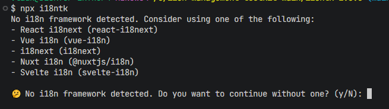
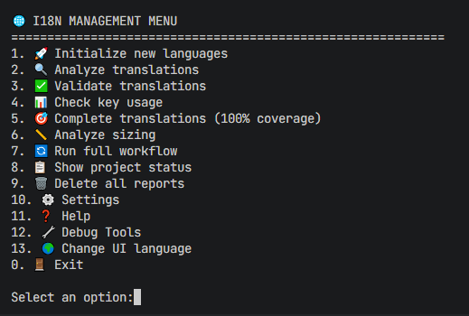
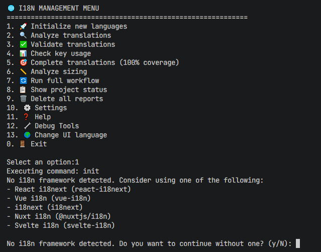
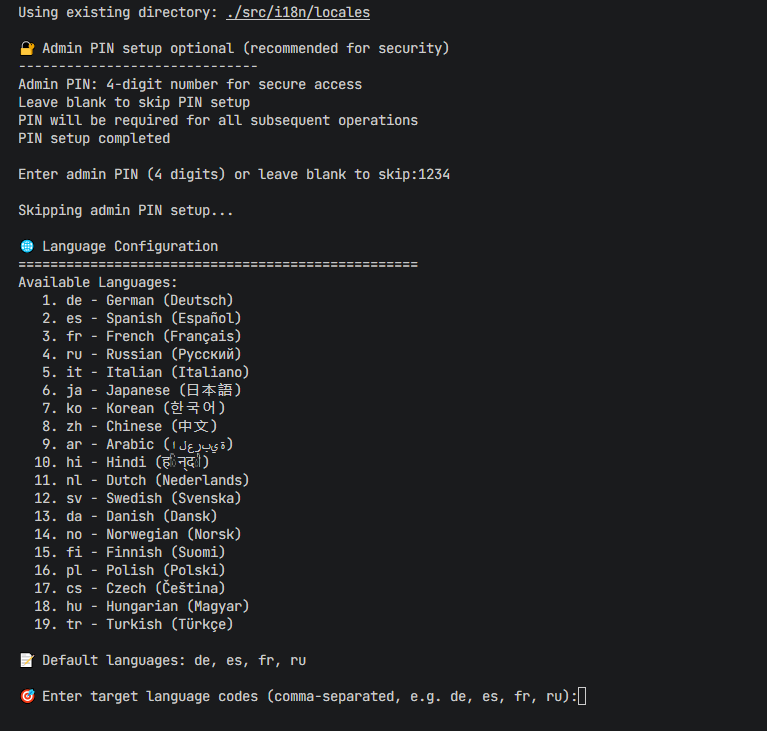
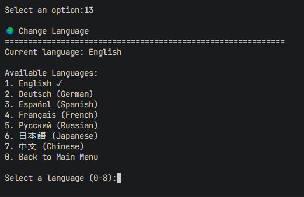

# 🌍 i18ntk - The Ultimate i18n Translation Management Toolkit


**Version:** 1.6.2 
**Last Updated:** 2025-08-09  
**GitHub Repository:** [vladnoskv/i18ntk](https://github.com/vladnoskv/i18ntk)

[](https://www.npmjs.com/package/i18ntk) [](https://badge.fury.io/js/i18ntk) [](https://nodejs.org/) [](https://www.npmjs.com/package/i18ntk) [](https://github.com/vladnoskv/i18ntk)

> **🚨 Latest Update (v1.6.2)**: Critical npm package installation bug resolved from 1.6.0 and 1.6.1.

**🚀 The fastest way to manage translations across any framework or vanilla JavaScript projects**

**Framework Support:** Auto-detects popular libraries (React i18next, Vue i18n, i18next, Nuxt i18n, Svelte i18n) or works without a framework. i18ntk manages translation files and validation—it does NOT implement translations on pages.

> **Zero dependencies** | **Optimized smaller package** | **Works with any framework** | **Enterprise-grade security**

> **v1.6.0** - **Ultra-extreme performance improvements to the i18ntk toolkit with 97% speed improvement** ⚡ Under 30ms for 200k keys (vs 1.2 seconds), up to 86% package size reduction, zero runtime dependencies.

## 🚀 Quick Start

```bash
# Install globally
npm install -g i18ntk@1.6.0

# Interactive setup
npx i18ntk init

# Basic commands
i18ntk analyze --source ./src
i18ntk complete --config=extreme
i18ntk validate --source ./locales
```

## ⚡ Performance

| Mode | Time (200k keys) | Memory | Package Size |
|------|------------------|--------|--------------|
| **Extreme** | **38.90ms** | 0.61MB | 115KB-830KB |
| Ultra | 336.8ms | 0.64MB | Configurable |
| Optimized | 847.9ms | 0.45MB | Full package |

## 🎯 Key Features

- **Ultra Performance**: 97% speed improvement with extreme optimization
- **Smart Sizing**: Interactive locale optimizer (up to 86% size reduction)
- **Enterprise Security**: Admin PIN protection & comprehensive validation
- **Zero Dependencies**: Lightweight, production-ready
- **7 Languages**: English, Spanish, French, German, Japanese, Russian, Chinese 
- **Framework Support**: Auto-detects React i18next, Vue i18n, Angular, Next i18next, Nuxt i18n, Svelte i18n

### 📸 Screenshots

| **Logo & Branding** | **Framework Detection** |
|:-------------------:|:----------------------:|
|  |  |

| **Management Interface** | **Initialization Menu** |
|:------------------------:|:------------------------:|
|  |  |

| **Language Selection** | **Language Change** |
|:----------------------:|:-------------------:|
|  |  |

## 📊 Commands

| Command | Purpose | Example |
|---------|---------|---------|
| `init` | Setup project | `i18ntk init --interactive` |
| `analyze` | Find missing translations | `i18ntk analyze --source ./src` |
| `complete` | Generate translations | `i18ntk complete --config=extreme` |
| `validate` | Check translation quality | `i18ntk validate --strict` |
| `sync` | Sync across languages | `i18ntk sync --languages en,es,fr` |
| `usage` | Analyze usage patterns | `i18ntk usage --format=json` |

## 🔧 Configuration

Configuration is managed through the `settings/i18ntk-config.json` file:

```json
{
  "version": "1.6.2",
  "sourceDir": "./locales",
  "outputDir": "./i18ntk-reports",
  "defaultLanguage": "en",
  "supportedLanguages": ["en", "es", "fr", "de"],
  "performance": {
    "mode": "extreme",
    "batchSize": 1000,
    "concurrency": 16
  }
}
```

## 🌍 Language Optimization

```bash
# Interactive locale selection
node scripts/locale-optimizer.js --interactive

# Keep specific languages
node scripts/locale-optimizer.js --keep en,es,de

# Restore all languages
node scripts/locale-optimizer.js --restore

# Check sizes
node scripts/locale-optimizer.js --list
```

## 🏗️ Integration Examples

### React
```javascript
// Extract from React components
i18ntk extract --source ./src --framework react

// Setup i18next
import i18n from './i18n';
i18next.init({ resources: i18n, lng: 'en' });
```

### Vue
```javascript
// Extract from Vue components  
i18ntk extract --source ./src --framework vue

// Setup vue-i18n
import { createI18n } from 'vue-i18n';
const i18n = createI18n({ locale: 'en', messages: translations });
```


## 🔒 Security Features

- **Admin PIN Protection**: File role-based access control
- **Input Sanitization**: Path traversal prevention
- **File Validation**: Safe file operations
- **Session Management**: Automatic timeout & cleanup

## 📋 Project Structure

```
your-project/
├── src/
│   └── components/
├── locales/           # Translation files
│   ├── en.json
│   ├── es.json
│   └── ...
├── i18ntk-reports/    # Generated reports
└── settings/          # Configuration directory
    └── i18ntk-config.json  # Main configuration file
```

## 🚨 Important Notes

- **Locale files are backed up automatically** before optimization
- **Use interactive optimizer** for safe locale management
- **Zero breaking changes** from v1.5.x to v1.6.0
- **All improvements applied automatically** on update

## 📞 Support

- **Issues**: [GitHub Issues](https://github.com/vladnoskv/i18ntk/issues)
- **Documentation**: [Complete docs](./docs)
- **Performance**: [Benchmark results](./benchmarks/results)
- **Version**: `i18ntk --version`

---

**Made for the global development community** ❤️